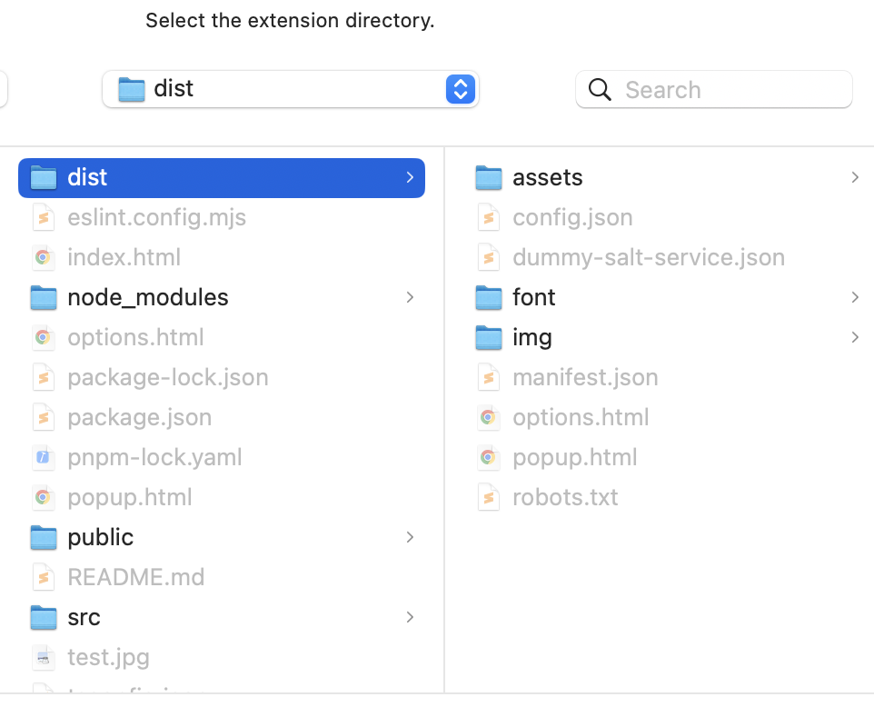
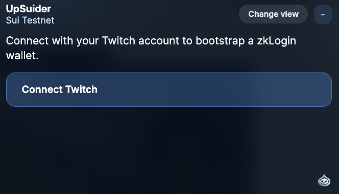
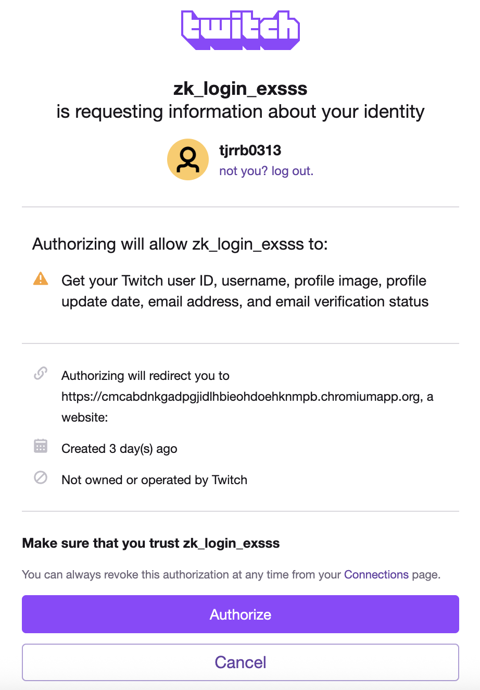
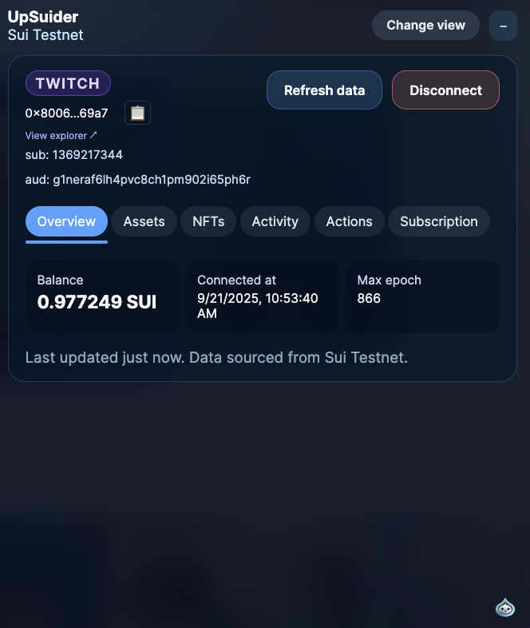
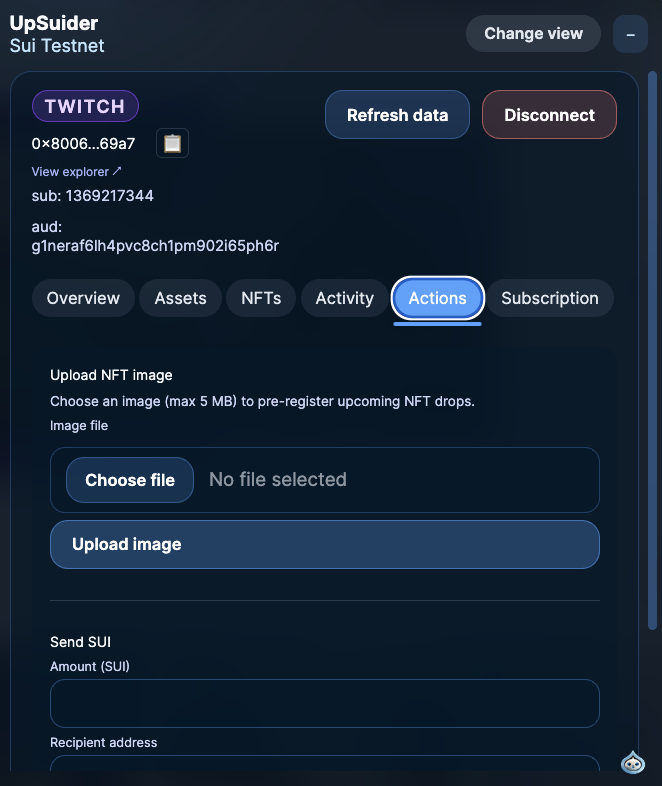
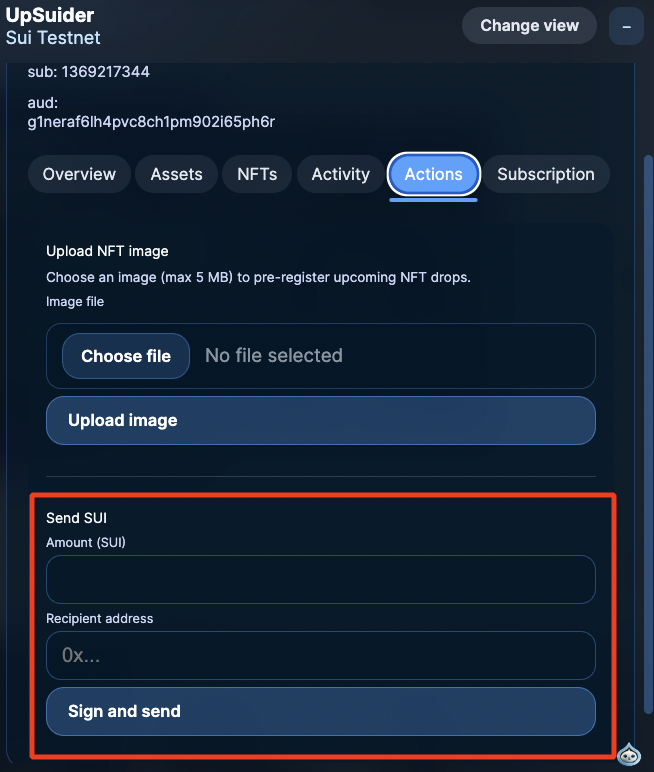
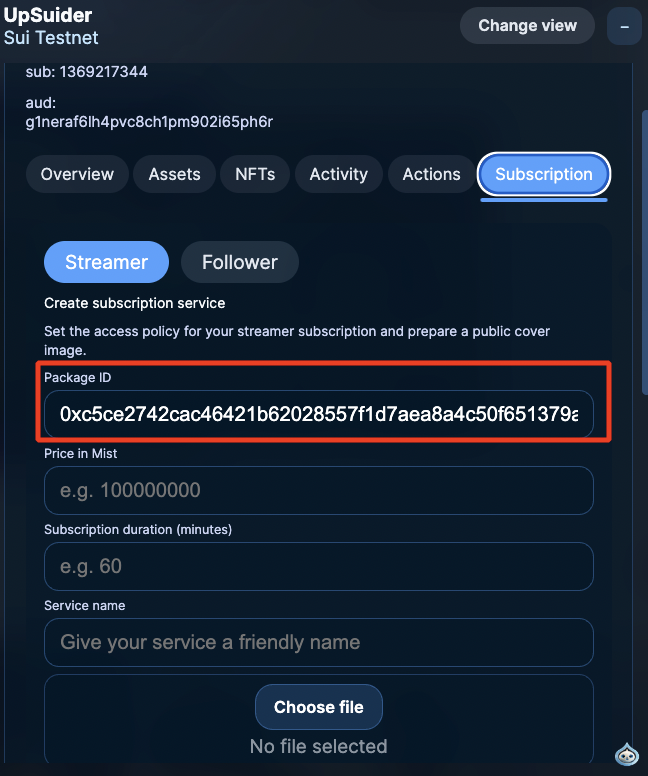
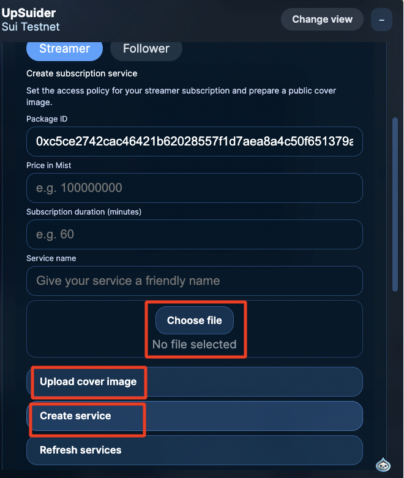
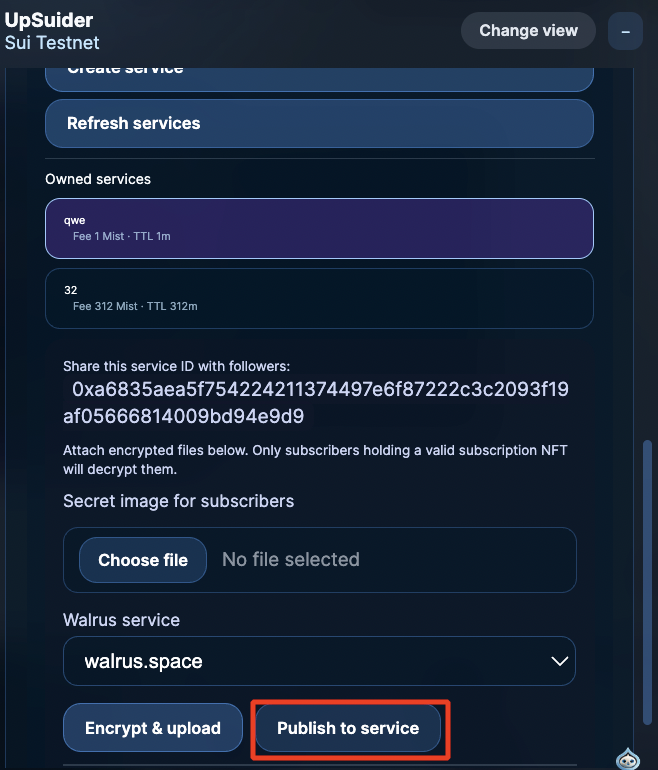
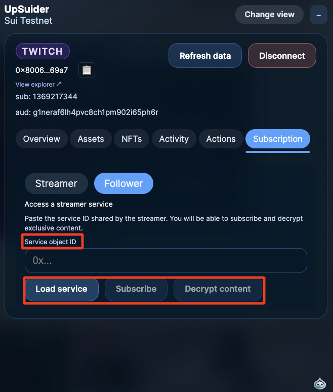

# UpSuider zkLogin Demo

UpSuider is a Chrome Manifest V3 extension that links Twitch OAuth with Sui zkLogin. Once a streamer connects their Twitch account through the extension popup, the background service provisions a Sui Testnet wallet, generates zkLogin proofs, and unlocks an overlay on twitch.tv that surfaces balances, transactions, NFT tools, and a Walrus-based subscription experience.

## Highlights
- Twitch OpenID Connect flow → zkLogin proof generation → automatic Testnet wallet session
- Twitch overlay showing balance, coin positions, NFTs, recent activity, and contextual actions
- `Actions` tab for Testnet SUI transfers, backend NFT image upload, overlay opacity and view mode controls
- Walrus + Mysten Seal powered subscription tab: create encrypted drops as a streamer, subscribe and decrypt as a follower
- Popup and Options pages to toggle overlays, manage zkLogin sessions, and update backend endpoints
- Global status widget and channel-points hook that reflect login state and mock reward badges across tabs

## Tech Stack
- React 19, TypeScript 5, Vite 6 with the SWC React plugin
- Chrome MV3 service worker using `chrome.identity` and `chrome.storage`
- `@mysten/sui` SDK (`client`, `transactions`, `zklogin`), `@mysten/seal`, Walrus testnet services
- Less-based styling with Web Animations API helpers for transitions

## Directory Layout
```
.
├─ public/                 # manifest.json, config.json, icons, fonts, static assets
├─ src/
│  ├─ background/          # service worker: Twitch OAuth, zkLogin proofs, transaction signing
│  ├─ content/             # twitch.tv overlay, global widget, channel points integrations
│  ├─ options/             # options page React UI
│  ├─ popup/               # browser action popup
│  ├─ shared/              # message types, storage helpers, encoding utilities
│  ├─ subscription/        # Walrus/Seal helpers and Move transaction builders
│  └─ types/               # ambient type declarations (@mysten/seal, node:* shims)
├─ vite.config.ts          # multi-entry build (service worker + UI bundles)
├─ package.json            # scripts and dependencies
└─ dist/                   # output consumed by Chrome after `pnpm build`
```

## Key Modules
- `src/background/index.ts`: orchestrates Twitch WebAuth, salt service calls, zk prover interaction, session caching, Sui transaction execution, NFT image uploads, and optional backend registration.
- `src/content/index.tsx`: mounts the React overlay on twitch.tv, syncs overlay position, handles opacity, and collapse modes.
- `src/content/ui/App.tsx`: primary overlay UI with streamer/viewer layouts and tabs (`overview`, `assets`, `nfts`, `activity`, `actions`, `subscription`).
- `src/content/channelPointsWidget.ts`: watches Twitch channel points DOM updates, drives the mock NFT mint counter, and broadcasts widget state.
- `src/content/globalStatusWidget.ts`: renders a draggable status card on allowed hosts and persists its position.
- `src/popup/ui/PopupApp.tsx`: lists connected accounts, exposes the overlay toggle, kicks off Twitch login, and surfaces quick overviews.
- `src/options/ui/OptionsApp.tsx`: edits Twitch Client ID, salt/prover URLs, backend/NFT/subscription endpoints, overlay placement, and session reset actions.
- `src/subscription/transactions.ts`: assembles Move calls (`create_service_entry`, `publish`, `subscribe`, `transfer`) for the Walrus subscription demo.

## Installation and Build
1. **Prerequisites**
   - Node.js 20+
   - `pnpm` (recommended; npm/yarn also work)
   - Chrome or any Chromium-based browser
2. **Install dependencies**
   ```bash
   pnpm install
   ```
3. **Build the extension**
   ```bash
   pnpm build
   ```
   - Outputs go to `dist/`, which you load as an unpacked extension.
4. **Optional: UI-only dev server**
   ```bash
   pnpm dev
   ```
   - Use for visual testing; Chrome extension APIs are not available in this mode.
5. **Quality gates**
   ```bash
   pnpm lint
   pnpm typecheck
   ```

## Configuration
- Default values live in `public/config.json` and ship with the build.
- Important keys:
  - `twitchClientId`: Twitch OpenID application client ID
  - `saltServiceUrl`: backend endpoint that ensures salts for Twitch users (ideally `/salts/ensure`)
  - `zkProverUrl` / `zkProverAuthToken`: Enoki prover endpoint and bearer token
  - `backendRegistrationUrl`: optional webhook that receives `{ walletAddress, twitchUserId, audience, registeredAt }`
  - `nftUploadUrl`: backend accepting streamer-uploaded images
  - `subscriptionPackageId`, `subscriptionMvrName`: Move package info for the Walrus demo policies
- While the extension is running you can change the same values in the Options page; sanitized copies persist in `chrome.storage.local`.
- For local testing set `saltServiceUrl` to `/dummy-salt-service.json`; the bundled mock responds with a fixed salt.

## Demo Walkthrough
### 1. Load the Extension

1. Run `pnpm build` to populate `dist/`.
2. Navigate to `chrome://extensions`, enable **Developer mode**, click **Load unpacked**, and select `dist`.
3. Confirm the UpSuider icon appears in the toolbar.


### 2. Connect a Twitch Account


1. Open the popup and click **Connect Twitch account**.

2. Complete the Twitch OAuth pop-up. The background worker will:
   - validate the ID token
   - call the configured salt service
   - request zk proofs from the prover
   - store the wallet session in `chrome.storage.session`  
3. The popup refreshes with the new account and begins fetching the on-chain overview.

### 3. Explore the Twitch Overlay
1. Visit `https://www.twitch.tv/<channel>` and look for the overlay in the top-right corner.
 
2. Tabs at a glance:
   - **Overview**: connection timestamp, max epoch, balance summary
   - **Assets**: SUI and other coin positions
   - **NFTs**: owned NFT object IDs with descriptions and Suiscan links
   - **Activity**: up to 10 recent transactions, each linked to Suiscan
   - **Actions**: image upload form and Testnet SUI transfer flow
   - **Subscription**: streamer/follower experiences powered by Walrus and Seal
3. Use the toolbar to switch between streamer/viewer views, collapse the overlay, drag it, and tweak opacity.

### 4. Upload an NFT Image
 
1. In the Actions tab, pick an image (default size limit: 5 MB).
2. Click **Upload image**. The worker POSTs to `nftUploadUrl` with `streamid`, filename, MIME type, and raw bytes.
3. A success banner confirms the backend accepted the asset.

### 5. Send Testnet SUI
 
1. Still in Actions, enter an amount and recipient address.
2. Click **Sign and send**. The worker may top up gas via the Testnet faucet, builds a `transfer-sui` transaction, signs it with zkLogin, and sends it to Testnet.
3. On success the digest appears with a link to Suiscan.

### 6. Subscription Demo
**Streamer flow**
 
1. Ensure the desired `subscriptionPackageId` is configured in Options.
2. In the Subscription tab (Streamer role) fill in price (Mist), TTL (minutes), and service name, then **Create service**.
 
 
3. Optionally choose a cover image, encrypt it with Mysten Seal, upload the encrypted blob to a Walrus publisher, and **Publish** it on-chain.

**Follower flow**
 
1. Switch to the follower’s wallet, open Subscription → Follower role, enter a service object ID, and click **Load service**.
2. Review price and TTL, then **Subscribe** to execute the Move call.
3. After activation, press **Decrypt**. The worker signs a session key via `SIGN_PERSONAL_MESSAGE`, fetches blobs from the Walrus aggregator, and decrypts them for display.

### 7. Global Widget and Channel Points
- The channel points watcher tracks balance changes, updates a mock mint counter, and keeps the floating global widget in sync.
- Widget position is draggable, persisted via `chrome.storage.sync`, and configurable in Options.

## Deploy Scripts
- `pnpm deploy-dev`: build and push to Cloudflare Pages (dev branch) via `wrangler`
- `pnpm deploy-prod`: same for the main branch; requires `wrangler` credentials and environment variables

## Debugging Tips
- If zkLogin fails, inspect `[background] startTwitchLogin failed` logs and verify salt/prover settings.
- Transaction issues usually surface through `ensureSuiForTransaction`; the thrown message hints at faucet/gas status.
- Missing overlays typically mean the bundle is stale—reload from `chrome://extensions` and ensure `assets/content.js` is present in DevTools → Sources.
- The Options action **Clear cached zkLogin sessions** removes ephemeral proofs and keys so the next login starts clean.

## References
- Sui zkLogin docs: https://docs.sui.io/concepts/cryptography/zklogin
- Enoki prover guidance: https://docs.sui.io/concepts/cryptography/zklogin#run-the-proving-service-in-your-backend
- Walrus testnet docs: https://docs.walrus.site/
- Mysten Seal SDK: https://docs.mystenlabs.com/devnet/build/seal
